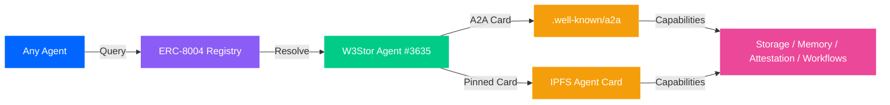
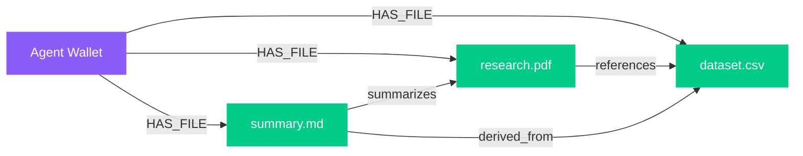
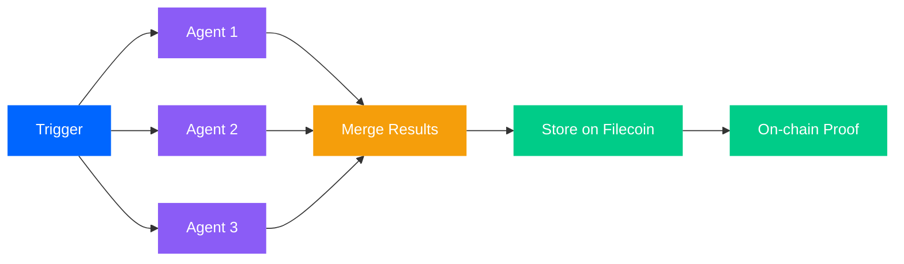
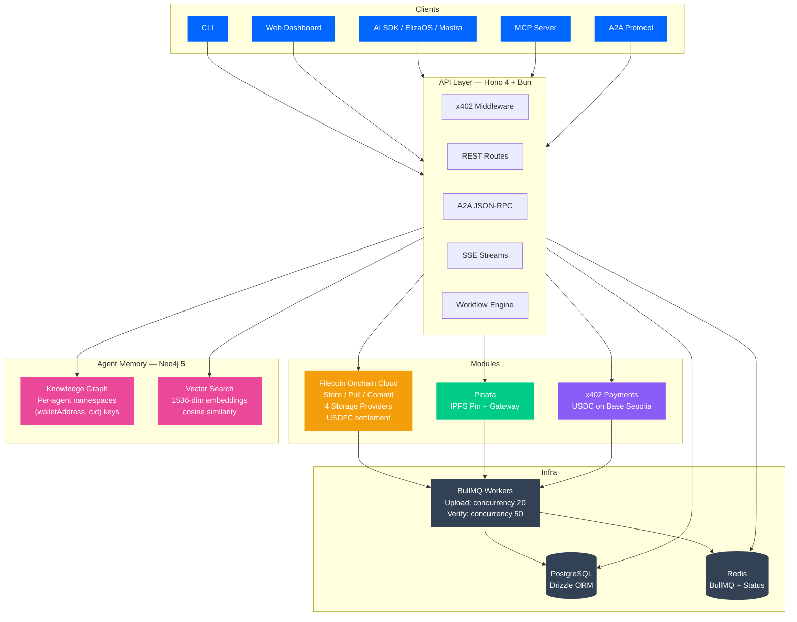

<p align="center" style="margin: 20px 0;">
  
</p>
<p align="center" style="margin: 20px 0;">
  
</p>
<p align="center" style="margin: 20px 0;">
  <strong>Decentralized memory &amp; storage for AI agents</strong> — powered by Filecoin, structured by agent memory graphs, paid with x402 micropayments.
</p>
<p align="center" style="margin: 20px 0;">
  <a href="https://www.npmjs.com/package/@w3stor/sdk"></a>&nbsp;
  <a href="https://www.npmjs.com/package/@w3stor/cli"></a>&nbsp;
  <a href="https://w3stor.xyz"></a>&nbsp;
  <a href="https://w3stor.xyz/docs"></a>&nbsp;
  <a href="https://github.com/aikarap/w3stor/blob/main/LICENSE"></a>
</p>
<h2 align="center">AI &nbsp; INTEGRATIONS</h4>
<p align="center">
  
</p>
<h2 align="center">POWERED &nbsp; BY</h4>
<p align="center">
  
</p>
<p align="center">
  <a href="#how-it-works">How It Works</a>&nbsp;&nbsp;|&nbsp;&nbsp;<a href="#agent-memory">Agent Memory</a>&nbsp;&nbsp;|&nbsp;&nbsp;<a href="#erc-8004-agent-discovery">ERC-8004</a>&nbsp;&nbsp;|&nbsp;&nbsp;<a href="#quick-start">Quick Start</a>&nbsp;&nbsp;|&nbsp;&nbsp;<a href="#agent-skill">Agent Skill</a>&nbsp;&nbsp;|&nbsp;&nbsp;<a href="#integrations">Integrations</a>&nbsp;&nbsp;|&nbsp;&nbsp;<a href="#api">API</a>&nbsp;&nbsp;|&nbsp;&nbsp;<a href="#architecture">Architecture</a>&nbsp;&nbsp;|&nbsp;&nbsp;<a href="#roadmap">Roadmap</a>
</p>
<br />

## Why

AI agents generate valuable data every second — research, analysis, generated assets, decision logs. Today it all lands in centralized buckets that can disappear, get censored, or price-gouge. Worse, agents can't *find* what they've stored — files are dumped into flat namespaces with no structure, no relationships, no memory.

And if you want decentralized storage today, agents have to onboard onto Filecoin, gather FIL tokens, swap into USDFC, and learn an entirely new payment stack just to store a file. **W3Stor abstracts all of that away.** Agents pay in USDC on the network they already live on — W3Stor handles the Filecoin side, pays providers in USDFC, and replicates across **4 Filecoin Onchain Cloud Storage Providers** in the background. No FIL. No USDFC. No onboarding. Just one API call.

> **Agents deserve persistent, verifiable, intelligent memory. W3Stor makes it one API call.**

<br />

---

<br />

## ERC-8004 Agent Discovery

W3Stor is **fully ERC-8004 + A2A registry compliant** and discoverable from any agent through the [ERC-8004 on-chain agent registry](https://sepolia.basescan.org/tx/0xfb153b6132c41a93a243d627dd4b38b2754177ffa9700b9bd42e17eed64e8dc2) on Base Sepolia. Any agent on any network can look up W3Stor's capabilities, endpoints, and A2A protocol surface directly from the registry contract — no off-chain directories needed.

<p align="center">
  <a href="https://testnet.8004scan.io/agents/base-sepolia/3635"></a>&nbsp;
  <a href="https://sepolia.basescan.org/tx/0xfb153b6132c41a93a243d627dd4b38b2754177ffa9700b9bd42e17eed64e8dc2"></a>&nbsp;
  <a href="https://api.w3stor.xyz/.well-known/a2a"></a>&nbsp;
  <a href="https://ipfs.io/ipfs/bafkreib2ovf5kwyjjj6i2gxyjn3tyk7jq6e5lqr5vxpx2k4uzphlgcprdy"></a>
</p>



- **Full ERC-8004 + A2A registry compliance** — W3Stor implements the complete agent registry interface and A2A discovery surface
- **On-chain registry** — agent metadata stored on Base Sepolia, verifiable by any smart contract or off-chain client
- **Agent ID [#3635](https://testnet.8004scan.io/agents/base-sepolia/3635)** — W3Stor's registered identity in the ERC-8004 registry
- **A2A well-known card** — live at [`api.w3stor.xyz/.well-known/a2a`](https://api.w3stor.xyz/.well-known/a2a) — standard A2A discovery endpoint
- **Agent card pinned to IPFS** — content-addressed at [`bafkreib2ovf5...prdy`](https://ipfs.io/ipfs/bafkreib2ovf5kwyjjj6i2gxyjn3tyk7jq6e5lqr5vxpx2k4uzphlgcprdy) so the card itself is decentralized and verifiable
- **Zero-trust discovery** — agents don't need to know W3Stor's URL ahead of time; they query the registry contract or fetch the IPFS-pinned card
- **Registry tx:** [`0xfb153b...8dc2`](https://sepolia.basescan.org/tx/0xfb153b6132c41a93a243d627dd4b38b2754177ffa9700b9bd42e17eed64e8dc2)

> **Note:** ERC-8004 is currently deployed on Base Sepolia testnet. Mainnet registry migration will follow alongside the broader mainnet rollout.

<br />

## How It Works


Upload a file. Get a CID instantly via Pinata IPFS pin. Replicated across **4 Filecoin Onchain Cloud Storage Providers** via BullMQ background workers. Status tracked through `pending → storing → stored → verified` states in real-time via Redis-backed SSE streams. Verified on-chain. Done.

Behind the scenes, agents pay W3Stor in **USDC via x402** on the network they already use. W3Stor settles with Filecoin Storage Providers in **USDFC on Filecoin** — so agents never have to onboard to Filecoin, hold FIL tokens, or learn a new payment stack just to access decentralized storage.

<br />

### Pricing

All payments use **USDC on Base Sepolia** via the x402 protocol. No accounts or API keys — just an EVM wallet.

| Operation | Cost |
|-----------|------|
| Upload | $0.0001 per MB |
| Storage attestation | $0.50 per attestation |
| Workflow execution | $0.001 per run |
| Graph operations (add, connect) | x402-gated |
| Read operations (list, search, status) | Free |

> **Note:** W3Stor currently operates on **Base Sepolia testnet**. Mainnet deployment with production USDC is on the roadmap.

<br />

## Agent Memory

Every agent gets a **sovereign memory graph** — a private namespace of files and relationships, searchable by meaning. Powered by Neo4j 5 with native 1536-dimension vector indexes and cosine similarity, eliminating the need for a separate vector database.



- **Sovereign namespaces** — each wallet owns its own graph, isolated by `(walletAddress, cid)` compound keys. No cross-agent leakage.
- **Freeform relationships** — agents define their own edge labels (`references`, `contradicts`, `derived_from`, ...)
- **Semantic search** — 1536-dimension vector embeddings on file metadata, cosine similarity via Neo4j's `db.index.vector.queryNodes`, filtered by wallet address
- **Graph traversal** — explore connected files by hops and relationship type
- **Batch ingestion** — upload multiple files with connections in a single x402 payment
- **Non-blocking** — memory ingestion never blocks uploads. Files are stored even if the graph layer is down.
- **SIWE authentication** — graph operations require Sign-In with Ethereum session tokens for namespace isolation

```bash
# Add a file to your agent memory
w3stor graph add bafkrei... --description "Q3 analysis" --tags "finance,quarterly"

# Connect files with relationships
w3stor graph connect bafkreiA bafkreiB --rel "references"

# Semantic search across your files
w3stor graph search "quarterly financial analysis"

# Explore connected files
w3stor graph traverse bafkreiA --depth 3
```

<br />

<table>
  <thead>
    <tr>
      <th width="140"></th>
      <th width="200">Traditional Cloud</th>
      <th width="200">IPFS Only</th>
      <th width="200">W3Stor</th>
    </tr>
  </thead>
  <tbody>
    <tr><td><strong>Speed</strong></td><td>Fast</td><td>Fast</td><td>Fast — IPFS pin + async Filecoin</td></tr>
    <tr><td><strong>Permanence</strong></td><td>Provider-dependent</td><td>No guarantees</td><td><strong>On-chain verified (4 Filecoin SPs)</strong></td></tr>
    <tr><td><strong>Payment</strong></td><td>Credit card / API key</td><td>Free (who pays?)</td><td><strong>x402 micropayments (USDC)</strong></td></tr>
    <tr><td><strong>Agent-ready</strong></td><td>REST only</td><td>No standard</td><td><strong>AI SDK / ElizaOS / Mastra / MCP / A2A</strong></td></tr>
    <tr><td><strong>Verifiable</strong></td><td>Trust the provider</td><td>Content-addressed</td><td><strong>On-chain attestation</strong></td></tr>
    <tr><td><strong>Discoverable</strong></td><td>None</td><td>None</td><td><strong>ERC-8004 on-chain agent registry</strong></td></tr>
    <tr><td><strong>Cost</strong></td><td>$0.023/GB/mo</td><td>Free*</td><td><strong>$0.0001/MB — one-time</strong></td></tr>
    <tr><td><strong>Memory</strong></td><td>None</td><td>None</td><td><strong>Agent memory graphs + semantic search</strong></td></tr>
  </tbody>
</table>

<br />

---

<br />

## Quick Start

```bash
npm install @w3stor/sdk
```

```typescript
import { createTools } from "@w3stor/sdk/ai-sdk";

const tools = await createTools({
  privateKey: process.env.PRIVATE_KEY, // EVM wallet for x402 payments
});
```

No accounts. No API keys. Just a wallet.

<br />

### x402 Payment Flow

Every paid operation follows a 5-step challenge-response flow — cost transparency *before* execution.

```mermaid
sequenceDiagram
    participant Agent
    participant W3Stor API
    participant Base Sepolia
    Agent->>W3Stor API: POST /upload (no payment)
    W3Stor API-->>Agent: 402 Payment Required + challenge
    Note right of Agent: Challenge includes exact cost
    Agent->>Agent: Sign challenge with EVM key
    Agent->>W3Stor API: POST /upload + Payment-Signature
    W3Stor API->>Base Sepolia: Verify USDC payment
    Base Sepolia-->>W3Stor API: Confirmed
    W3Stor API-->>Agent: 200 OK + CID + audit receipt
```



The x402 middleware (`@x402/evm` integration) handles automatic challenge signing so SDK users never interact with the payment flow directly. USDC contract: `0x036CbD53842c5426634e7929541eC2318f3dCF7e` on Base Sepolia (Chain ID 84532).

<br />

---

<br />

## Agent Skill

Give any AI agent permanent decentralized storage in one command.

```bash
npx skills add https://github.com/aikarap/w3stor --skill w3stor
```

The skill exposes all W3Stor capabilities — upload, list, status, attest, memory graph, wallet management — as native agent tools. Works with Claude Code, Cursor, and any MCP-compatible client.

<details>
<summary><strong>What's included</strong></summary>

<br />

| Command | Description | Costs USDC |
|---------|-------------|:----------:|
| `w3stor upload <file>` | Upload a file to IPFS + Filecoin | Yes |
| `w3stor files` | List uploaded files | No |
| `w3stor status <cid>` | Check replication across SPs | No |
| `w3stor attest <cid>` | Get cryptographic storage attestation | Yes |
| `w3stor graph add <cid>` | Add file to agent memory | Yes |
| `w3stor graph connect` | Create file-to-file relationship | Yes |
| `w3stor graph search <query>` | Semantic search across your files | No |
| `w3stor graph traverse <cid>` | Explore connected files | No |
| `w3stor graph remove <cid>` | Remove file from graph | No |
| `w3stor auth login` | SIWE session auth for graph ops | No |
| `w3stor wallet balance` | Check USDC balance (Base Sepolia) | No |
| `w3stor wallet address` | Show configured wallet address | No |
| `w3stor health` | Check server + service health | No |

</details>

<details>
<summary><strong>MCP server mode</strong></summary>

<br />

The CLI doubles as a Model Context Protocol server. Running `w3stor --mcp` exposes all commands as agent-callable tools over stdio transport.

```bash
npm install -g @w3stor/cli

# Initialize with your wallet
w3stor init --auto           # reads PRIVATE_KEY from env
w3stor init --privateKey 0x...

# Start as MCP server — all commands become agent tools
w3stor --mcp
```

**MCP tools exposed:**

| Tool | Description |
|------|-------------|
| `web3_storage_upload` | Upload file to IPFS + Filecoin |
| `web3_storage_list` | List stored files by wallet |
| `web3_storage_status` | Check replication status |
| `web3_storage_attest` | Get on-chain storage attestation |
| `graph_add_file` | Add file to agent memory graph |
| `graph_search` | Semantic search across memory |
| `graph_connect_files` | Create file relationships |

</details>

<details>
<summary><strong>Example usage</strong></summary>

<br />

```bash
# Upload with tags + metadata
w3stor upload research.pdf --tags "research,permanent"
w3stor upload data.csv --metadata '{"project":"alpha"}'

# Query files
w3stor files --status fully_replicated
w3stor files --search "report" --tags "dataset"

# Check replication + attest
w3stor status bafkrei...
w3stor attest bafkrei...

# Output formatting for agents
w3stor files --format json
w3stor files --format yaml
w3stor health --format md
```

</details>

<br />

---

<br />

## Integrations

Built **agent-first**. One import, permanent storage.

<br />

<details>
<summary><strong>Vercel AI SDK</strong></summary>

<br />

```typescript
import { createTools } from "@w3stor/sdk/ai-sdk";

const tools = await createTools({ privateKey: process.env.PRIVATE_KEY });

const result = await generateText({
  model: openai("gpt-4o"),
  tools,
  messages: [{ role: "user", content: "Store my research paper permanently" }],
});
```

</details>

<details>
<summary><strong>ElizaOS</strong></summary>

<br />

```typescript
import { createW3StorPlugin } from "@w3stor/sdk/elizaos";

const plugin = await createW3StorPlugin({ privateKey: process.env.PRIVATE_KEY });
// Actions: STORE_ON_FILECOIN, LIST_STORED_FILES, CHECK_STATUS
```

</details>

<details>
<summary><strong>Mastra</strong></summary>

<br />

```typescript
import { createTools } from "@w3stor/sdk/mastra";

const tools = await createTools({ privateKey: process.env.PRIVATE_KEY });
```

</details>

<details>
<summary><strong>A2A Protocol</strong> — Agent-to-Agent</summary>

<br />

The SDK exports `@w3stor/sdk/a2a` with agent card and executor support. **W3Stor is fully ERC-8004 + A2A registry compliant** — agents can discover it on-chain or via the standard A2A well-known endpoint, and the agent card itself is pinned to IPFS for decentralized verification.

```bash
# Discover — A2A well-known card (standard endpoint)
curl https://api.w3stor.xyz/.well-known/a2a

# Discover — IPFS-pinned agent card (decentralized)
curl https://ipfs.io/ipfs/bafkreib2ovf5kwyjjj6i2gxyjn3tyk7jq6e5lqr5vxpx2k4uzphlgcprdy

# Discover — ERC-8004 on-chain registry (Agent #3635 on Base Sepolia)

# Interact — JSON-RPC message exchange
curl -X POST https://api.w3stor.xyz/a2a/jsonrpc \
  -d '{"jsonrpc":"2.0","method":"message/send","params":{...}}'
```

</details>

<br />

> **npm:** [`@w3stor/sdk`](https://www.npmjs.com/package/@w3stor/sdk) &nbsp;&bull;&nbsp; [`@w3stor/cli`](https://www.npmjs.com/package/@w3stor/cli) &nbsp;&bull;&nbsp; **Docs:** [w3stor.xyz/docs](https://w3stor.xyz/docs)

<br />

---

<br />

## Workflows

Build **multi-agent workflows** visually on the [W3Stor dashboard](https://w3stor.xyz) — chain outputs, fan out research swarms, persist everything to Filecoin.



- **Visual builder** — React Flow drag-and-drop with Jotai state management, supports up to 8 agents per workflow
- **5 pre-built agent roles** — Scout, Analyst, Builder, Critic, Synth — with custom agent configuration
- **Multi-agent orchestration** — chain agent outputs into storage pipelines
- **Research swarms** — fan out queries, collect and archive results
- **x402-powered execution** — pay for AI inference + storage in one flow with cost estimation before execution
- **Full audit trail** — per-node cost breakdown on every run
- **SSE execution streaming** — real-time progress updates during workflow runs

<br />

---

<br />

## API

All endpoints served by Hono 4 on Bun runtime. x402-gated endpoints return `402 Payment Required` with exact cost before execution. Graph endpoints require SIWE session tokens.

| Method | Endpoint | Auth | Description |
|--------|----------|:----:|-------------|
| `POST` | `/upload` | x402 | Upload file (multipart) |
| `POST` | `/upload/batch` | x402 | Batch upload with graph connections |
| `GET` | `/files` | | List files by wallet |
| `GET` | `/status/:cid` | | Replication status across SPs |
| `POST` | `/attest/:cid` | x402 | Cryptographic storage attestation |
| `GET` | `/events/files/:cid` | | SSE real-time replication stream |
| `POST` | `/workflows/:id/execute` | x402 | Execute workflow |
| `POST` | `/graph/files` | x402 | Add file to agent memory |
| `POST` | `/graph/connections` | x402 | Create file relationship |
| `GET` | `/graph/search` | SIWE | Semantic search across memory |
| `GET` | `/graph/traverse/:cid` | SIWE | Graph traversal from file |
| `GET` | `/graph/view` | SIWE | Full memory graph (dashboard) |
| `POST` | `/a2a/jsonrpc` | | A2A JSON-RPC |
| `GET` | `/.well-known/a2a` | | A2A well-known agent card (ERC-8004 + A2A compliant) |
| `GET` | `/.well-known/agent-card.json` | | Legacy A2A agent discovery |
| `POST` | `/auth/siwe/nonce` | | Get SIWE auth nonce |
| `POST` | `/auth/siwe/verify` | | Verify SIWE signature, get JWT |
| `GET` | `/health` | | Service health |
| `GET` | `/metrics` | | Prometheus metrics |

> Full reference at [w3stor.xyz/docs](https://w3stor.xyz/docs)

<br />

---

<br />

## Architecture



<br />

### Storage Pipeline

Files flow through a multi-stage pipeline with status tracking at each step:

1. **IPFS Pin** — Pinata generates CID instantly, file available via IPFS gateway
2. **CAR Build** — file packaged into CAR format for Filecoin (`packages/modules/src/filecoin/upload-car.ts`)
3. **SP Upload** — BullMQ workers (concurrency 20) distribute to **4 Filecoin Onchain Cloud Storage Providers**, settled in USDFC on Filecoin
4. **Status Tracking** — `pending → storing → stored → verified` via Redis pub/sub channels
5. **SSE Stream** — clients subscribe to `/events/files/:cid` for real-time updates
6. **Pinata Unpin** — after SP confirmation, IPFS pin is released to save costs

<br />

### Monorepo

```
apps/web              Next.js 16 dashboard + docs + workflows (App Router)
packages/shared       Types, config, logger, errors
packages/db           Drizzle ORM (PostgreSQL), queries, migrations
packages/graph        Agent memory — Neo4j knowledge graphs + vector search
packages/modules      Filecoin, Pinata, x402, SIWE, queue
packages/sdk          AI SDK + ElizaOS + Mastra + A2A  →  npm @w3stor/sdk
packages/api          Hono 4 HTTP server
packages/workers      BullMQ background jobs (Filecoin uploads, verification)
packages/cli          CLI + MCP server  →  npm @w3stor/cli
```

### Technology Stack

| Layer | Technology | Details |
|-------|-----------|---------|
| Runtime | Bun | TypeScript throughout, Turborepo monorepo |
| API | Hono 4 | REST routes, SSE streams, x402 + SIWE middleware |
| Database | PostgreSQL | Drizzle ORM for users, files, workflows |
| Cache/Queue | Redis + BullMQ 5 | Job queues, status pub/sub channels |
| Memory Graph | Neo4j 5 | Vector indexes (1536-dim), per-agent namespaces |
| Storage | Filecoin Onchain Cloud + Pinata | CAR uploads to 4 SPs, USDFC settlement, IPFS gateway |
| Payments | x402 + USDC | Base Sepolia (Chain ID 84532), `@x402/evm` |
| Frontend | Next.js 16 | App Router, React Flow, Jotai |
| Registry | ERC-8004 | Base Sepolia, Agent #3635 |

<br />

---

<br />

## Roadmap

**Shipped**

- [x] IPFS pinning via Pinata + Filecoin replication (4 Filecoin Onchain Cloud SPs)
- [x] x402 micropayments (USDC on Base Sepolia)
- [x] AI SDK, ElizaOS, Mastra integrations
- [x] MCP server (CLI `--mcp` flag, stdio transport)
- [x] A2A protocol — full ERC-8004 + A2A registry compliance, well-known card, IPFS-pinned agent card
- [x] Visual workflow builder (React Flow, up to 8 agents)
- [x] Real-time SSE status updates
- [x] CLI with agent-friendly output (JSON, YAML, Markdown)
- [x] Web dashboard — [w3stor.xyz](https://w3stor.xyz)
- [x] Agent Memory — per-agent Neo4j knowledge graphs with 1536-dim vector search
- [x] SIWE session auth + batch uploads with graph connections
- [x] Interactive memory graph visualization (dashboard)
- [x] ERC-8004 on-chain agent registry — [Agent #3635](https://testnet.8004scan.io/agents/base-sepolia/3635) on Base Sepolia

**Next**

The next phase is **universal access**: go live on Filecoin mainnet and accept payments from **any network that has USDC** — Base, Ethereum, Arbitrum, Optimism, Polygon, Solana, and beyond. The vision is simple: **any agent on any network gets fast, decentralized storage and agentic memory retrieval in one API call**, with W3Stor handling all of the Filecoin complexity in the background.

Agents pay with the USDC they already have. W3Stor replicates across **4 Filecoin Onchain Cloud Storage Providers** and pays providers in **USDFC on Filecoin** under the hood. Agents never need to onboard to Filecoin, gather FIL tokens, or learn USDFC just to access decentralized storage and memory.

- [ ] **Filecoin mainnet deployment** — production Filecoin Onchain Cloud SP replication
- [ ] **Multi-chain USDC payments** — accept x402 payments from any network with USDC (Base, Ethereum, Arbitrum, Optimism, Polygon, Solana)
- [ ] **Universal agent access** — any agent on any network, one API call, zero Filecoin onboarding
- [ ] Lit Protocol validator network — stake/slash SLAs backed by Filecoin Onchain Cloud on-chain guarantees

<br />

---

<br />

## Resources

| Resource | Link |
|----------|------|
| Live Demo | [w3stor.xyz](https://w3stor.xyz) |
| Documentation | [w3stor.xyz/docs](https://w3stor.xyz/docs) |
| SDK (npm) | [`@w3stor/sdk`](https://www.npmjs.com/package/@w3stor/sdk) |
| CLI (npm) | [`@w3stor/cli`](https://www.npmjs.com/package/@w3stor/cli) |
| Repository | [github.com/aikarap/w3stor](https://github.com/aikarap/w3stor) |
| ERC-8004 Registry | [Agent #3635](https://testnet.8004scan.io/agents/base-sepolia/3635) |
| Registry Transaction | [BaseScan](https://sepolia.basescan.org/tx/0xfb153b6132c41a93a243d627dd4b38b2754177ffa9700b9bd42e17eed64e8dc2) |
| A2A Well-Known Card | [`api.w3stor.xyz/.well-known/a2a`](https://api.w3stor.xyz/.well-known/a2a) |
| Agent Card on IPFS | [`bafkreib2ovf5...prdy`](https://ipfs.io/ipfs/bafkreib2ovf5kwyjjj6i2gxyjn3tyk7jq6e5lqr5vxpx2k4uzphlgcprdy) |
| Project Video | [Watch demo](https://auth.devspot.app/storage/v1/object/public/project-videos/videos/1901/4b30f3f1-93e3-4a8a-b2c3-5b6d11c3474a.mp4) |
| Skill Demo Videos | [Google Drive](https://drive.google.com/drive/folders/1xcbsfC6pwzLyetSdbPXzuZzbQ6RyAiU2?usp=sharing) |

<br />

---

<br />

<p align="center">
  <a href="https://star-history.com/#aikarap/w3stor">
    <picture>
      <source media="(prefers-color-scheme: dark)" srcset="https://api.star-history.com/svg?repos=aikarap/w3stor&type=Date&theme=dark" />
      <source media="(prefers-color-scheme: light)" srcset="https://api.star-history.com/svg?repos=aikarap/w3stor&type=Date" />
      
    </picture>
  </a>
</p>

<br />

<p align="center">
  <a href="https://w3stor.xyz">Website</a>&nbsp;&nbsp;&bull;&nbsp;&nbsp;<a href="https://w3stor.xyz/docs">Docs</a>&nbsp;&nbsp;&bull;&nbsp;&nbsp;<a href="https://www.npmjs.com/package/@w3stor/sdk">SDK</a>&nbsp;&nbsp;&bull;&nbsp;&nbsp;<a href="https://www.npmjs.com/package/@w3stor/cli">CLI</a>
</p>

<p align="center">
  <sub>MIT License</sub>
</p>


