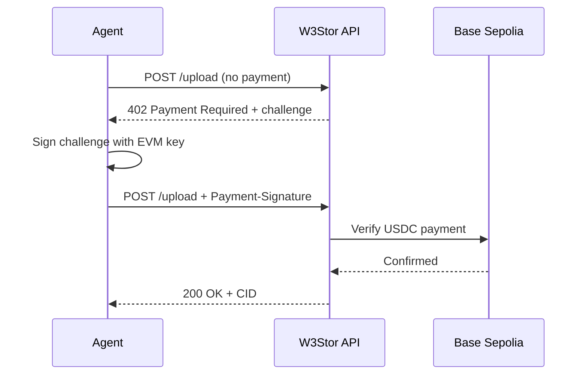
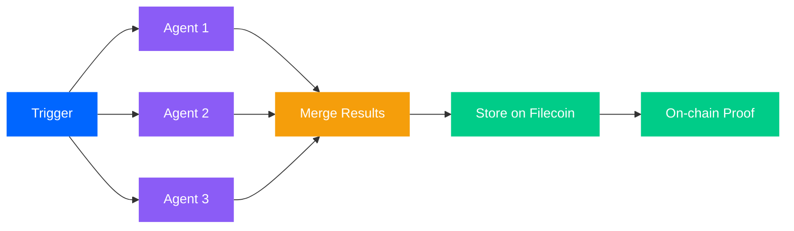
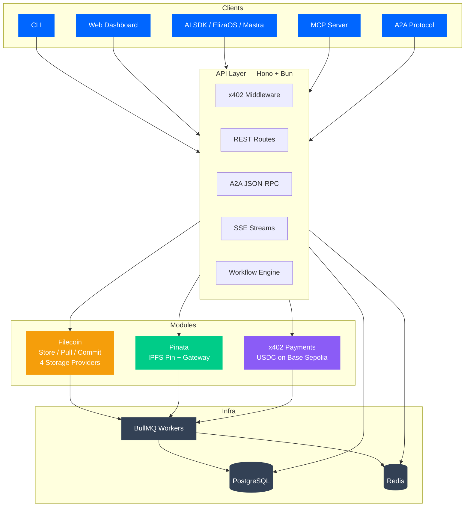

<p align="center" style="margin: 20px 0;">
  
</p>

<p align="center" style="margin: 20px 0;">
  
</p>

<p align="center" style="margin: 20px 0;">
  <strong>Decentralized storage for AI agents</strong> — powered by Filecoin, paid with x402 micropayments.
</p>

<p align="center" style="margin: 20px 0;">
  <a href="https://www.npmjs.com/package/@w3stor/sdk"></a>&nbsp;
  <a href="https://www.npmjs.com/package/@w3stor/cli"></a>&nbsp;
  <a href="https://w3stor.xyz"></a>&nbsp;
  <a href="https://w3stor.xyz/docs"></a>&nbsp;
  <a href="https://github.com/aikarap/w3stor/blob/main/LICENSE"></a>
</p>

<h2 align="center">AI &nbsp; INTEGRATIONS</h4>
<p align="center">
  
</p>

<h2 align="center">POWERED &nbsp; BY</h4>
<p align="center">
  
</p>

<p align="center">
  <a href="#how-it-works">How It Works</a>&nbsp;&nbsp;|&nbsp;&nbsp;<a href="#quick-start">Quick Start</a>&nbsp;&nbsp;|&nbsp;&nbsp;<a href="#agent-skill">Agent Skill</a>&nbsp;&nbsp;|&nbsp;&nbsp;<a href="#integrations">Integrations</a>&nbsp;&nbsp;|&nbsp;&nbsp;<a href="#api">API</a>&nbsp;&nbsp;|&nbsp;&nbsp;<a href="#architecture">Architecture</a>&nbsp;&nbsp;|&nbsp;&nbsp;<a href="#roadmap">Roadmap</a>
</p>

<br />

## Why

AI agents generate valuable data every second — research, analysis, generated assets, decision logs. Today it all lands in centralized buckets that can disappear, get censored, or price-gouge.

> **Agents deserve permanent, verifiable, decentralized storage. W3Stor makes it one API call.**

<br />

## How It Works


Upload a file. Get a CID instantly. Replicated across 4 Storage Providers. Verified on-chain. Done.

<br />

<table>
  <thead>
    <tr>
      <th width="140"></th>
      <th width="200">Traditional Cloud</th>
      <th width="200">IPFS Only</th>
      <th width="200">W3Stor</th>
    </tr>
  </thead>
  <tbody>
    <tr><td><strong>Speed</strong></td><td>Fast</td><td>Fast</td><td>Fast — IPFS pin + async Filecoin</td></tr>
    <tr><td><strong>Permanence</strong></td><td>Provider-dependent</td><td>No guarantees</td><td><strong>On-chain verified (4 SPs)</strong></td></tr>
    <tr><td><strong>Payment</strong></td><td>Credit card / API key</td><td>Free (who pays?)</td><td><strong>x402 micropayments</strong></td></tr>
    <tr><td><strong>Agent-ready</strong></td><td>REST only</td><td>No standard</td><td><strong>AI SDK / ElizaOS / Mastra / MCP / A2A</strong></td></tr>
    <tr><td><strong>Verifiable</strong></td><td>Trust the provider</td><td>Content-addressed</td><td><strong>On-chain attestation</strong></td></tr>
    <tr><td><strong>Cost</strong></td><td>$0.023/GB/mo</td><td>Free*</td><td><strong>$0.001/MB — one-time</strong></td></tr>
  </tbody>
</table>

<br />

---

<br />

## Quick Start

```bash
npm install @w3stor/sdk
```

```typescript
import { createTools } from "@w3stor/sdk/ai-sdk";

const tools = await createTools({
  privateKey: process.env.PRIVATE_KEY, // EVM wallet for x402 payments
});
```

No accounts. No API keys. Just a wallet.

<br />

### x402 Payment Flow



<br />

---

<br />

## Agent Skill

Give any AI agent permanent decentralized storage in one command.

```bash
npx skills add https://github.com/aikarap/w3stor --skill w3stor
```

The skill exposes all W3Stor capabilities — upload, list, status, attest, wallet management — as native agent tools. Works with Claude Code, Cursor, and any MCP-compatible client.

<details>
<summary><strong>What's included</strong></summary>

<br />

| Command | Description | Costs USDC |
|---------|-------------|:----------:|
| `w3stor upload <file>` | Upload a file to IPFS + Filecoin | Yes |
| `w3stor files` | List uploaded files | No |
| `w3stor status <cid>` | Check replication across SPs | No |
| `w3stor attest <cid>` | Get cryptographic storage attestation | Yes |
| `w3stor wallet balance` | Check USDC balance (Base Sepolia) | No |
| `w3stor wallet address` | Show configured wallet address | No |
| `w3stor health` | Check server + service health | No |

</details>

<details>
<summary><strong>MCP server mode</strong></summary>

<br />

```bash
npm install -g @w3stor/cli

# Initialize with your wallet
w3stor init --auto           # reads PRIVATE_KEY from env
w3stor init --privateKey 0x...

# Start as MCP server — all commands become agent tools
w3stor --mcp
```

</details>

<details>
<summary><strong>Example usage</strong></summary>

<br />

```bash
# Upload with tags + metadata
w3stor upload research.pdf --tags "research,permanent"
w3stor upload data.csv --metadata '{"project":"alpha"}'

# Query files
w3stor files --status fully_replicated
w3stor files --search "report" --tags "dataset"

# Check replication + attest
w3stor status bafkrei...
w3stor attest bafkrei...

# Output formatting for agents
w3stor files --format json
w3stor files --format yaml
w3stor health --format md
```

</details>

<br />

---

<br />

## Integrations

Built **agent-first**. One import, permanent storage.

<br />

<details>
<summary><strong>Vercel AI SDK</strong></summary>

<br />

```typescript
import { createTools } from "@w3stor/sdk/ai-sdk";

const tools = await createTools({ privateKey: process.env.PRIVATE_KEY });

const result = await generateText({
  model: openai("gpt-4o"),
  tools,
  messages: [{ role: "user", content: "Store my research paper permanently" }],
});
```

</details>

<details>
<summary><strong>ElizaOS</strong></summary>

<br />

```typescript
import { createW3StorPlugin } from "@w3stor/sdk/elizaos";

const plugin = await createW3StorPlugin({ privateKey: process.env.PRIVATE_KEY });
// Actions: STORE_ON_FILECOIN, LIST_STORED_FILES, CHECK_STATUS
```

</details>

<details>
<summary><strong>Mastra</strong></summary>

<br />

```typescript
import { createTools } from "@w3stor/sdk/mastra";

const tools = await createTools({ privateKey: process.env.PRIVATE_KEY });
```

</details>

<details>
<summary><strong>A2A Protocol</strong> — Agent-to-Agent</summary>

<br />

```bash
# Discover
curl https://api.w3stor.xyz/.well-known/agent-card.json

# Interact
curl -X POST https://api.w3stor.xyz/a2a/jsonrpc \
  -d '{"jsonrpc":"2.0","method":"message/send","params":{...}}'
```

</details>

<br />

> **npm:** [`@w3stor/sdk`](https://www.npmjs.com/package/@w3stor/sdk) &nbsp;&bull;&nbsp; [`@w3stor/cli`](https://www.npmjs.com/package/@w3stor/cli) &nbsp;&bull;&nbsp; **Docs:** [w3stor.xyz/docs](https://w3stor.xyz/docs)

<br />

---

<br />

## Workflows

Build **multi-agent workflows** visually on the [W3Stor dashboard](https://w3stor.xyz) — chain outputs, fan out research swarms, persist everything to Filecoin.



- **Visual builder** — drag-and-drop nodes and edges
- **Multi-agent orchestration** — chain agent outputs into storage pipelines
- **Research swarms** — fan out queries, collect and archive results
- **x402-powered execution** — pay for AI inference + storage in one flow
- **Full audit trail** — per-node cost breakdown on every run

<br />

---

<br />

## API

| Method | Endpoint | Auth | Description |
|--------|----------|:----:|-------------|
| `POST` | `/upload` | x402 | Upload file (multipart) |
| `GET` | `/files` | | List files by wallet |
| `GET` | `/status/:cid` | | Replication status across SPs |
| `POST` | `/attest/:cid` | x402 | Cryptographic storage attestation |
| `GET` | `/events/files/:cid` | | SSE real-time replication stream |
| `POST` | `/workflows/:id/execute` | x402 | Execute workflow |
| `POST` | `/a2a/jsonrpc` | | A2A JSON-RPC |
| `GET` | `/.well-known/agent-card.json` | | A2A agent discovery |
| `GET` | `/health` | | Service health |
| `GET` | `/metrics` | | Prometheus metrics |

> Full reference at [w3stor.xyz/docs](https://w3stor.xyz/docs)

<br />

---

<br />

## Architecture



<br />

### Monorepo

```
apps/web              Next.js dashboard + docs + workflows
packages/shared       Types, config, logger, errors
packages/db           Drizzle ORM, queries, migrations
packages/modules      Filecoin, Pinata, x402, queue
packages/sdk          AI SDK + ElizaOS + Mastra + A2A  →  npm
packages/api          Hono API server
packages/workers      BullMQ background jobs
packages/cli          CLI + MCP server  →  npm
```

<br />

---

<br />

## Roadmap

**Shipped**

- [x] IPFS pinning + Filecoin replication (4 SPs)
- [x] x402 micropayments (USDC on Base Sepolia)
- [x] AI SDK, ElizaOS, Mastra integrations
- [x] MCP server + A2A protocol
- [x] Visual workflow builder
- [x] Real-time SSE status updates
- [x] CLI with agent-friendly output
- [x] Web dashboard — [w3stor.xyz](https://w3stor.xyz)

**Next**

- [ ] Filecoin mainnet
- [ ] Multi-chain x402 payments
- [ ] ERC-8004 on-chain agent registry
- [ ] Claude SDK tool plugin
- [ ] Production attestation certificates

<br />

---

<br />

<p align="center">
  <a href="https://star-history.com/#aikarap/w3stor">
    <picture>
      <source media="(prefers-color-scheme: dark)" srcset="https://api.star-history.com/svg?repos=aikarap/w3stor&type=Date&theme=dark" />
      <source media="(prefers-color-scheme: light)" srcset="https://api.star-history.com/svg?repos=aikarap/w3stor&type=Date" />
      
    </picture>
  </a>
</p>

<br />

<p align="center">
  <a href="https://w3stor.xyz">Website</a>&nbsp;&nbsp;&bull;&nbsp;&nbsp;<a href="https://w3stor.xyz/docs">Docs</a>&nbsp;&nbsp;&bull;&nbsp;&nbsp;<a href="https://www.npmjs.com/package/@w3stor/sdk">SDK</a>&nbsp;&nbsp;&bull;&nbsp;&nbsp;<a href="https://www.npmjs.com/package/@w3stor/cli">CLI</a>
</p>

<p align="center">
  <sub>MIT License</sub>
</p>


